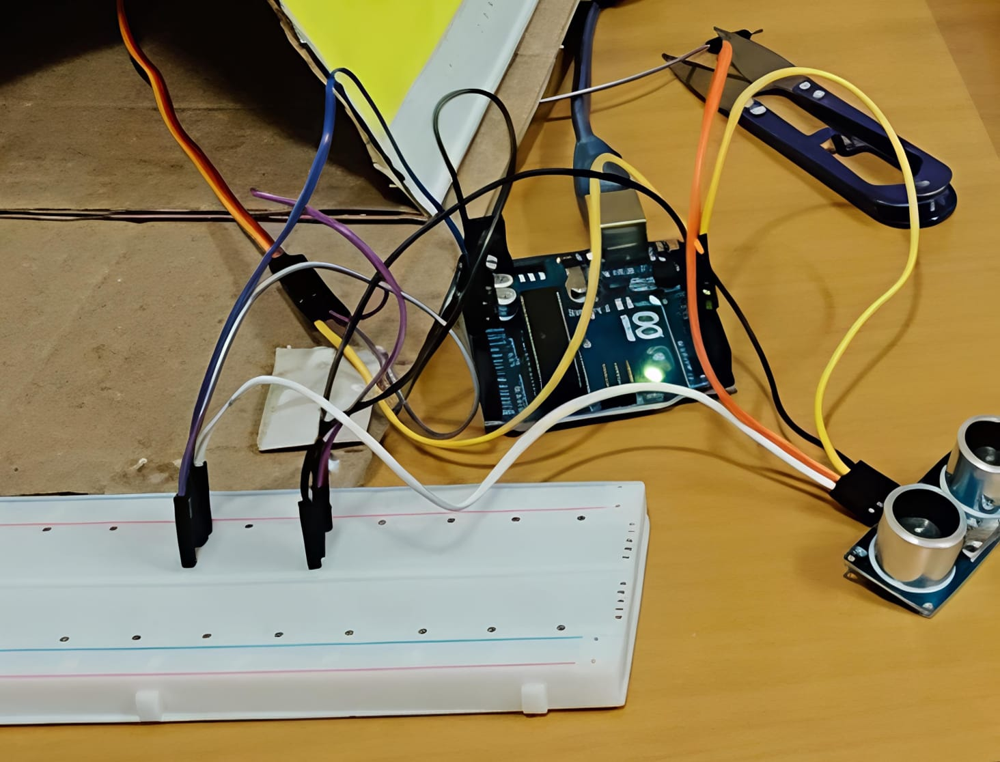
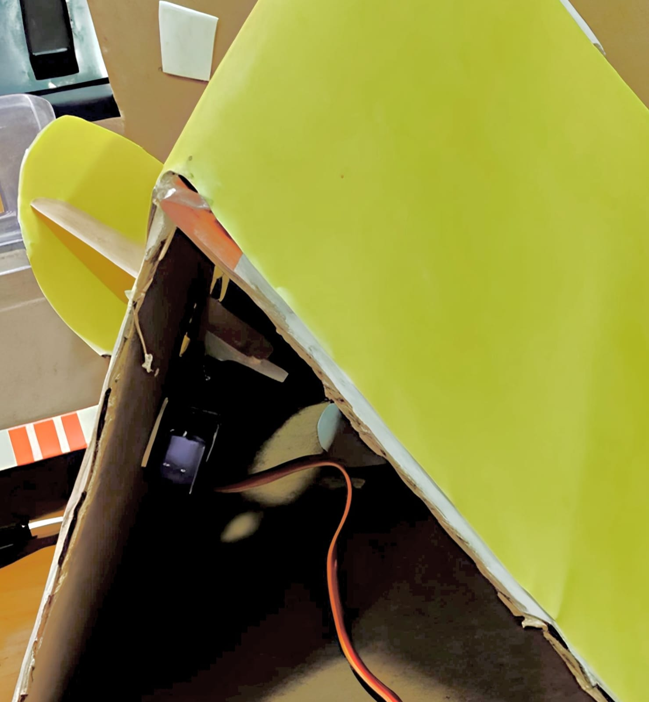
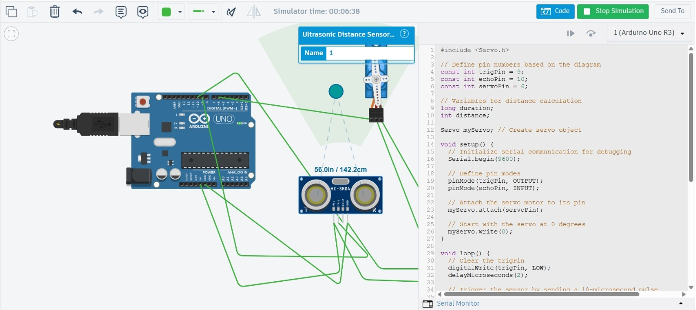
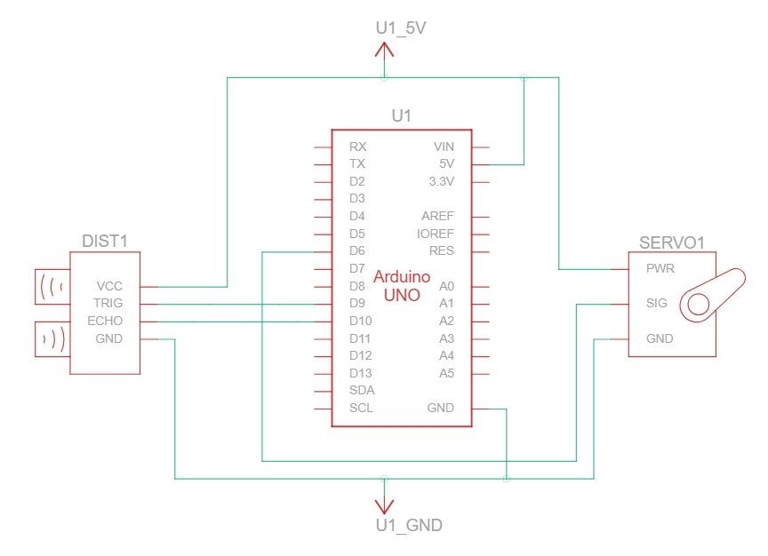

#       ULTRASONIC SENSOR-BASED AUTOMATIC BIRD NURSERY DOOR USING ARDUINO AND SERVO MOTOR

1\. PROBLEM STATEMENT

Manual operation of doors in bird nurseries and small animal enclosures requires human supervision. An automated system can provide controlled access by detecting when an object approaches the entrance and operating the door accordingly.

2\. SOLUTION

The system uses an Arduino Uno, HC-SR04 ultrasonic sensor, and SG90 servo motor to automate the door of a cardboard bird nursery model.

The ultrasonic sensor measures the distance to an approaching object. When an object is detected within 20 cm, the Arduino commands the servo motor to rotate to 90°. A wooden stick connected to the servo horn transfers this movement to the yellow door panel and opens it. After approximately 2 seconds, the servo returns to 0°, allowing the door to close.

The system was developed using both Tinkercad simulation and a physical hardware prototype.

3\. OBJECTIVE

* To develop an Arduino-based automatic nursery door that:  
* Detects an approaching object using an HC-SR04 ultrasonic sensor.  
* Uses a 20 cm detection threshold.  
* Controls an SG90 servo motor according to the detected distance.  
* Operates the nursery door through a wooden stick linkage.  
* Demonstrates sensor-based automatic control through simulation and hardware.

4\. COMPONENTS USED

| S. No.	  | Component	 | Quantity | 	Function |
| :---: | ----- | ----- | ----- |
| 1 | Arduino Uno R3 |                1 | Main control unit |
| 2 | HC-SR04 Ultrasonic Sensor | 1 | Measures distance  |
| 3 | SG90 Servo Motor | 1 | Opens and closes the door  |
| 4 | Solderless Breadboard | 1 | Circuit wiring  |
| 5 | Jumper Wires	 | 	As required	 | Electrical connections  |
| 6 | USB Cable |  1 | Programming and power |
| 7 | Cardboard Nursery Model | 1 | Physical model |
| 8 | Wooden Stick	 | 1 | Mechanical door linkage  |

5\. CIRCUIT SETUP AND CONNECTIONS

The Arduino Uno, HC-SR04 ultrasonic sensor, and SG90 servo motor were connected using a breadboard and jumper wires. The complete circuit was then integrated with the cardboard bird nursery model.

The servo motor was mounted inside the nursery, and a wooden stick was connected between the servo horn and the yellow door panel to transfer the servo movement to the door.  
     

Figure 5.1: Overall hardware setup of the Arduino-based automatic bird nursery doo.                                            

Figure 5.2: Interior view of the cardboard bird nursery model showing the SG90 servo motor and wooden stick linkage.  
Circuit Connections

| Component Pin	 | Arduino Pin	 |                Purpose |
| :---: | ----- | ----- |
| HC-SR04 VCC | 5V	 | 	Sensor power |
| HC-SR04 TRIG |                   D9 | Trigger signal |
| 	 HC-SR04 ECHO |                D10 | 	Echo signal |
| HC-SR04 GND |                 GND | Common ground |
| Servo PWR |                 5V | 	Servo power |
| Servo SIG |                 D6 | Servo control |
| Servo GND | 		                GND | Common ground |

6\. SIMULATION AND SCHEMATIC

The circuit was simulated using Tinkercad Circuits to verify the distance-sensing and servo-control logic.

During the documented simulation, the HC-SR04 measured a distance of 142.2 cm. Since this value is greater than the programmed 20 cm threshold, the servo remains at the closed-door position.  
        

Figure 6.1: Tinkercad simulation showing a measured distance 

The circuit schematic shows the connections between the Arduino Uno, ultrasonic sensor, and servo motor.  
         

Figure 6.2: Circuit schematic of the automatic bird nursery door system.

7\. WORKING PRINCIPLE

The HC-SR04 ultrasonic sensor determines distance by measuring the time taken for an ultrasonic pulse to travel to an object and return.

The distance is calculated using:

Distance \= (Duration × 0.034) / 2

The Arduino compares the calculated distance with the 20 cm threshold.

| Detected Distance | Servo Position |  		 DoorCondition |
| :---: | :---: | ----- |
| Greater than 20 cm	 |     0°	 | Closed |
|  Below 20 cm | 90° |                  Open |
|  Invalid/zero reading	 | 0° |  Closed |

When an object comes within 20 cm, the servo rotates to 90° and holds the position for approximately 2 seconds. The wooden stick linkage transfers this movement to the yellow door panel. The servo then returns to 0°, closing the door.

Operating Sequence

1\. Arduino initializes the ultrasonic sensor and servo.  
2\. Servo starts at 0°, keeping the door closed.  
3\. HC-SR04 measures the distance to the approaching object.  
4\. Arduino calculates the distance.  
5\. If the distance is below 20 cm, the servo moves to 90°.  
6\. The linkage operates the yellow nursery door.  
7\. After approximately 2 seconds, the servo returns to 0°  
8\. The process continuously repeats.

8\. ARDUINO PROGRAM

\#include \<Servo.h\>

const int trigPin \= 9;  
const int echoPin \= 10;  
const int servoPin \= 6;  
long duration;  
int distance;  
Servo myServo;

void setup() {  
  Serial.begin(9600);  
  pinMode(trigPin, OUTPUT);  
  pinMode(echoPin, INPUT);  
  myServo.attach(servoPin);  
  myServo.write(0);  
}  
void loop() {  
  digitalWrite(trigPin, LOW);  
  delayMicroseconds(2);  
  digitalWrite(trigPin, HIGH);  
  delayMicroseconds(10);  
  digitalWrite(trigPin, LOW);  
  duration \= pulseIn(echoPin, HIGH);  
  distance \= duration \* 0.034 / 2;  
  Serial.print("Distance: ");  
  Serial.print(distance);  
  Serial.println(" cm");  
  if (distance \> 0 && distance \< 20\) {  
    myServo.write(90);  
    delay(2000);  
  } else {  
    myServo.write(0);  
  }  
 delay(100);}

9\. OUTPUT AND OBSERVATIONS

| Condition |  	Expected Result |  	Recorded Result |
| :---: | :---: | :---: |
| Object beyond 20 cm | Door remains closed; servo at 0° | 	142.2 cm observed in simulation |
| Object within 20 cm	Door opens | servo moves to 90°	 | Hardware test to be documented  |

The hardware setup confirms the installation of the servo motor and mechanical linkage inside the nursery model. A photograph or video of the door opening during a below-20-cm test can be added later as additional hardware evidence.

10\. APPLICATIONS

* Automated doors for bird nurseries and small animal enclosures  
* Automatic feeding and watering systems  
* Proximity-based doors and gates  
* Sensor-controlled access mechanisms  
* Arduino-based automation prototypes  
* Educational demonstrations of sensor and actuator control  
  * 

11\. LEARNING OUTCOMES

* Through this project, the following concepts were learned:  
* Interfacing an HC-SR04 ultrasonic sensor with Arduino Uno  
* Controlling an SG90 servo motor  
* Understanding ultrasonic distance measurement  
* Applying conditional logic to sensor data  
* Understanding sensor-to-actuator control  
* Converting servo rotation into mechanical movement  
* Circuit wiring and hardware implementation  
* Simulating an Arduino-based control system using Tinkercad  
* Integrating electronics with a physical mechanical model

12\. CONCLUSION

The Ultrasonic Sensor-Based Automatic Bird Nursery Door demonstrates the integration of ultrasonic sensing, Arduino-based control, servo actuation, and mechanical movement.

The HC-SR04 sensor measures the distance to an approaching object, while the Arduino compares the measurement with a 20 cm threshold. When the object is within the specified range, the SG90 servo rotates to 90°, operating the yellow nursery door through a wooden stick linkage. After approximately 2 seconds, the servo returns to 0°.

The system was verified through Tinkercad simulation, where a distance of 142.2 cm was recorded outside the detection range, and the complete electronic system was integrated into a physical cardboard bird nursery model.

The project provides a practical demonstration of sensor-based automation using Arduino, combining electronic sensing, programming, actuator control, and mechanical implementation in a single prototype.  

